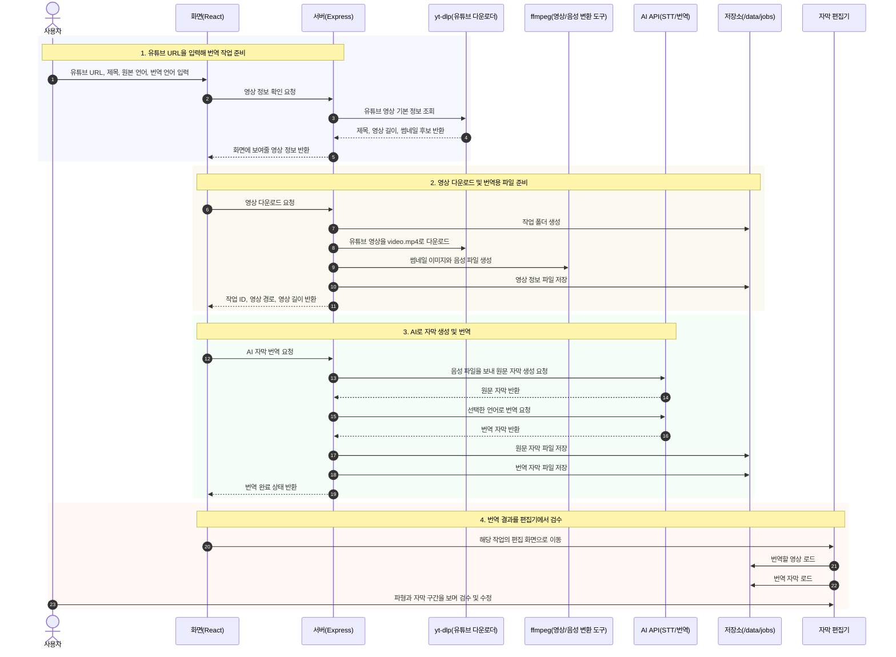
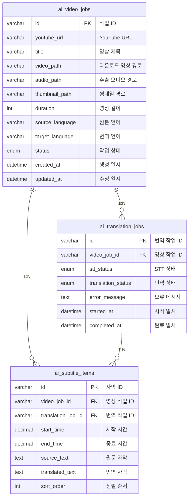

# 유튜브 AI 번역기

YouTube URL을 입력하면 영상을 서버에 내려받고, 음성 추출과 AI 자막 번역을 거쳐 현재 Waveform 기반 자막 편집기에서 바로 검수할 수 있도록 확장하는 프로젝트입니다.  
React와 TypeScript 기반 편집 화면에 Express API를 연결하고, `yt-dlp`, `ffmpeg`, AI STT/번역 API를 조합해 `URL 입력 -> 영상 다운로드 -> 자막 생성/번역 -> 편집기 검수` 흐름을 구현합니다.

---

## 시퀀스 다이어그램



---

## 시연 영상

AI 영상 번역 기능 구현 후 추가 예정입니다.

---

## 시연 사이트

구현 후 배포 URL 추가 예정입니다.

---

## ERD



---

## 기술 스택

**프론트엔드**


**백엔드**


**미디어 처리**


**데이터 저장**


**기타**


---

## Problem -> Solution -> Impact

- 문제: 자막 Region 1000개 이상에서 스크롤 중 전체 DOM 재생성으로 INP 548 ms, Scripting 80 ms 수준의 체감 지연이 발생했습니다.
- 해결: 가상 스크롤로 뷰포트 주변 30초 버퍼만 생성/유지하고, `lodash/throttle(500 ms)`로 스크롤 이벤트를 제한했습니다. 드래그 중에는 `isUpdating` 플래그로 중복 렌더링을 방지했습니다.
- 결과:

| 지표 | 개선 전 | 개선 후 | 개선율 |
| --- | --- | --- | --- |
| INP | 548 ms | **170 ms** | 약 69% 감소 |
| Script 실행 | 80 ms | **28 ms** | 약 65% 감소 |
| FPS | 30대 | **60 고정** | 약 100% 개선 |

---

## 외부 API/라이브러리 연동 및 주요 인프라 기능

- **yt-dlp(유튜브 다운로더)**: YouTube URL을 받아 영상 정보 확인과 영상 다운로드 처리
- **FFmpeg(영상/음성 변환 도구)**: 다운로드한 영상에서 썸네일 이미지와 음성 파일 추출
- **AI STT API(음성 인식)**: `audio.mp3`를 원문 자막으로 변환
- **AI Translation API(자막 번역)**: 원문 자막을 사용자가 선택한 언어로 번역
- **WaveSurfer.js(파형 기반 편집 도구)**: 오디오 파형, 자막 구간, 타임라인 기반 편집 UI 구성
- **Express Static Data Serving**: `/data/jobs/{jobId}` 하위 영상, 썸네일, 자막 JSON 제공

---

## yt-dlp 서버 설정

서버에서는 시스템 Python에 `pip install -U yt-dlp`를 직접 실행하지 않는 것을 기본값으로 둡니다. Debian/Ubuntu 계열은 특정 정책으로 시스템 Python 환경이 보호될 수 있으므로, 운영 서버에서는 `pipx install yt-dlp` 방식이 권장됩니다.

```bash
pipx install yt-dlp
```

pipx 실행 파일 경로가 PM2 또는 systemd의 `PATH`에 잡히지 않으면 `.env`에 명시합니다.

```env
YTDLP_BIN=/home/joon/.local/bin/yt-dlp
YTDLP_AUTO_UPDATE=false
```

자동 업데이트가 꼭 필요하면 명시적으로 켭니다. 기본 업데이트 방식은 `pipx upgrade yt-dlp`입니다.

```env
YTDLP_AUTO_UPDATE=true
YTDLP_UPDATE_METHOD=pipx
```
