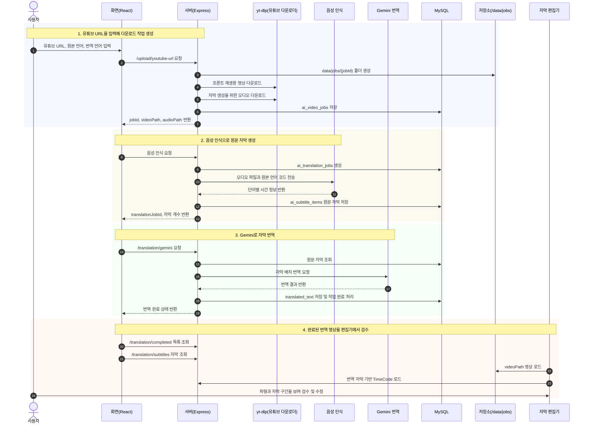
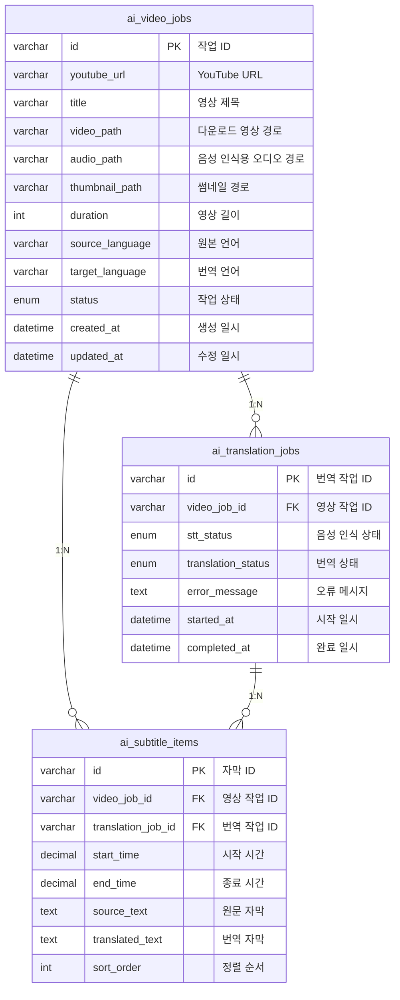

# 유튜브 AI 번역기

YouTube URL을 입력하면 영상과 음성 인식용 오디오를 서버에 내려받고, AI로 자막을 생성·번역한 뒤 영상과 자막을 함께 보며 바로 검수·수정할 수 있도록 확장한 프로젝트입니다.  
React와 TypeScript 기반 편집 화면에 Express API를 연결하고, `yt-dlp`, ElevenLabs 음성 인식 API, Gemini 번역 API, MySQL을 조합해 `URL 입력 -> 영상/오디오 다운로드 -> 자막 생성 -> 번역 -> 편집기 검수` 흐름을 구현합니다.

---

## 시퀀스 다이어그램




## 시연 영상

AI 영상 번역 기능 구현 후 추가 예정입니다.

---

## 시연 사이트

구현 후 배포 URL 추가 예정입니다.

---

## 구현 범위

- YouTube URL을 입력해 서버의 `data/jobs/{jobId}` 폴더에 영상과 음성 인식용 오디오를 저장합니다.
- 다운로드 작업, 음성 인식 작업, 번역 작업, 자막 아이템은 MySQL 테이블에 저장합니다.
- ElevenLabs 음성 인식 응답의 단어별 시간 정보를 자막 구간으로 묶어 저장합니다.
- Gemini API로 저장된 원문 자막을 번역하고, 완료된 작업 목록에서 편집기로 다시 불러옵니다.
- 편집기는 기존 WaveSurfer 기반 자막 타임라인을 재사용하며, 완료 작업 선택 시 영상과 번역 자막을 교체합니다.
- 썸네일은 별도 이미지 파일을 생성하지 않고 YouTube 기본 썸네일 URL을 사용합니다.
- 현재 구현은 ffmpeg로 영상/오디오를 후처리하지 않습니다. yt-dlp 포맷 선택과 병합 기능에 의존합니다.

---

## ERD



---

## 기술 스택

**프론트엔드**


**백엔드**


**미디어 처리**


**데이터 저장**


**기타**


---

## Problem -> Solution -> Impact

- 문제: 자막 Region 1000개 이상에서 스크롤 중 전체 DOM 재생성으로 INP 548 ms, Scripting 80 ms 수준의 체감 지연이 발생했습니다.
- 해결: 가상 스크롤로 뷰포트 주변 30초 버퍼만 생성/유지하고, `lodash/throttle(500 ms)`로 스크롤 이벤트를 제한했습니다. 드래그 중에는 `isUpdating` 플래그로 중복 렌더링을 방지했습니다.
- 결과:

| 지표 | 개선 전 | 개선 후 | 개선율 |
| --- | --- | --- | --- |
| INP | 548 ms | **170 ms** | 약 69% 감소 |
| Script 실행 | 80 ms | **28 ms** | 약 65% 감소 |
| FPS | 30대 | **60 고정** | 약 100% 개선 |

---

## 외부 API/라이브러리 연동 및 주요 인프라 기능

- **yt-dlp(유튜브 다운로더)**: YouTube URL을 받아 프론트 재생용 영상과 음성 인식용 오디오 다운로드 처리
- **ElevenLabs 음성 인식 API**: yt-dlp로 받은 오디오 파일을 원문 자막으로 변환
- **Gemini Translation API(자막 번역)**: 원문 자막을 사용자가 선택한 언어로 번역
- **MySQL 작업 저장소**: 영상 작업, 음성 인식/번역 작업, 자막 구간과 번역문 저장
- **WaveSurfer.js(파형 기반 편집 도구)**: 오디오 파형, 자막 구간, 타임라인 기반 편집 UI 구성
- **Express Static Data Serving**: `/data/jobs/{jobId}` 하위 다운로드 영상과 오디오 파일 제공

---

## yt-dlp 서버 설정

서버에서는 시스템 Python에 `pip install -U yt-dlp`를 직접 실행하지 않는 것을 기본값으로 둡니다. Debian/Ubuntu 계열은 특정 정책으로 시스템 Python 환경이 보호될 수 있으므로, 운영 서버에서는 `pipx install yt-dlp` 방식이 권장됩니다.

```bash
pipx install yt-dlp
```

pipx 실행 파일 경로가 PM2 또는 systemd의 `PATH`에 잡히지 않으면 `.env`에 명시합니다.

```env
YTDLP_BIN=/home/joon/.local/bin/yt-dlp
YTDLP_AUTO_UPDATE=false
```

자동 업데이트가 꼭 필요하면 명시적으로 켭니다. 기본 업데이트 방식은 `pipx upgrade yt-dlp`입니다.

```env
YTDLP_AUTO_UPDATE=true
YTDLP_UPDATE_METHOD=pipx
```
